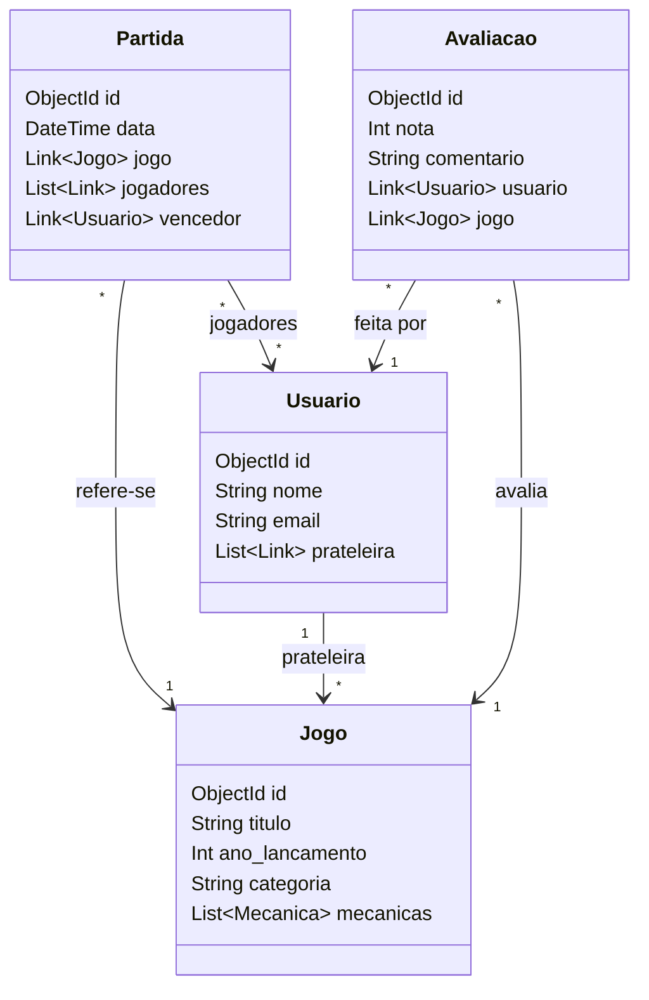

# Diagrama de Classes

```mermaid

classDiagram
    class Jogo {
        ObjectId id
        String titulo
        Int ano_lancamento
        String categoria
        List~Mecanica~ mecanicas
    }
    class Usuario {
        ObjectId id
        String nome
        String email
        List~Link~ prateleira
    }
    class Partida {
        ObjectId id
        DateTime data
        Link~Jogo~ jogo
        List~Link~ jogadores
        Link~Usuario~ vencedor
    }
    class Avaliacao {
        ObjectId id
        Int nota
        String comentario
        Link~Usuario~ usuario
        Link~Jogo~ jogo
    }
    Usuario "1" --> "*" Jogo : prateleira
    Partida "*" --> "1" Jogo : refere-se
    Partida "*" --> "*" Usuario : jogadores
    Avaliacao "*" --> "1" Usuario : feita por
    Avaliacao "*" --> "1" Jogo : avalia
```